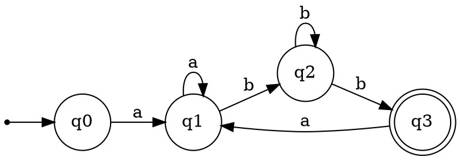

# Laboratory Work No. 2: Determinism in Finite Automata. Conversion from NDFA to DFA. Chomsky Hierarchy

### Course: Formal Languages & Finite Automata

### Author: Polina Clepicova

### Variant 7


---

## Table of Contents

1. [Theory](#theory)
2. [Objectives](#objectives)
3. [Implementation Description](#implementation-description)
4. [Code Snippets](#code-snippets)
5. [Challenges and Difficulties](#challenges-and-difficulties)
6. [Conclusions / Results](#conclusions--results)
7. [References](#references)

---

## Theory

### Finite Automata

A **finite automaton (FA)** is an abstract machine used to recognize patterns within input taken from a finite alphabet. Formally, an FA is a 5-tuple $(Q, \Sigma, \delta, q_0, F)$ where:

* $Q$ is a finite set of **states**,
* $\Sigma$ is a finite **input alphabet**,
* $\delta : Q \times \Sigma \to \mathcal{P}(Q)$ is the **transition function** (for an NFA) or $\delta : Q \times \Sigma \to Q$ (for a DFA),
* $q_0 \in Q$ is the **initial state**,
* $F \subseteq Q$ is the set of **final (accepting) states**.

### Determinism vs. Non-determinism

* A **deterministic finite automaton (DFA)** has exactly one transition for each state and each input symbol. Its behaviour is completely predictable.
* A **non-deterministic finite automaton (NFA)** may have zero, one, or multiple transitions for a given state and symbol. It can be in several states at once, introducing choices.

### Conversion from NFA to DFA

Every NFA can be transformed into an equivalent DFA that accepts the same language. The standard method is the **subset construction** (also called powerset construction):

1. The start state of the DFA is the set containing the NFA's start state.
2. For each new DFA state (a set of NFA states) and for each input symbol, compute the set of all NFA states reachable from any state in that set via that symbol. This becomes a transition in the DFA.
3. Repeat until no new states appear. Any DFA state that contains at least one NFA final state is a final state.

### Finite Automata and Regular Grammars

A **regular grammar** (Type-3 in the Chomsky hierarchy) can be obtained directly from a finite automaton:

* Non-terminals correspond to states.
* Terminals are the alphabet symbols.
* For every transition $\delta(p, a) = q$ we add a production $p \to a q$.
* For every final state $f$ we add $f \to \varepsilon$ (the empty string).

### Chomsky Hierarchy

Grammars are classified into four levels:

* **Type-0 (Unrestricted):** no restrictions.
* **Type-1 (Context-sensitive):** productions are of the form $\alpha A \beta \to \alpha \gamma \beta$ with $\gamma \neq \varepsilon$.
* **Type-2 (Context-free):** left-hand side is a single non-terminal.
* **Type-3 (Regular):** right-linear form $A \to aB$ or $A \to a$ (or left-linear). Regular grammars correspond exactly to languages recognized by finite automata.

---

## Objectives

1. Extend the grammar class from the previous lab to include a method that classifies a grammar according to the Chomsky hierarchy.
2. For the given variant (Variant 7):
   * Convert the finite automaton into an equivalent regular grammar.
   * Determine whether the automaton is deterministic or non-deterministic.
   * If non-deterministic, convert it to a deterministic finite automaton (DFA).
   * *(Optional)* Represent the automaton graphically.

---

## Implementation Description

The implementation is written in Python, following an object-oriented approach. Two main classes are defined:

### `Grammar` Class

* **Attributes:** `non_terminals` (set), `terminals` (set), `productions` (dictionary mapping a non-terminal to a list of right-hand sides), `start_symbol`.
* **Method `classify()`:** Checks the productions against the definitions of Type-0, Type-1, Type-2, and Type-3. For a grammar derived from an FA, it will always return **Type-3 (Regular)**.

### `FiniteAutomaton` Class

* **Attributes:** `states` (set), `alphabet` (set), `transitions` (dictionary with keys `(state, symbol)` and values as a **set** of target states – this naturally allows non-determinism), `initial_state`, `final_states` (set).
* **Method `is_deterministic()`:** Iterates over all `(state, symbol)` pairs. If any pair has more than one target state, returns `False`; otherwise `True`. Also checks that every state has a transition for every symbol (totality).
* **Method `to_regular_grammar()`:** Constructs a `Grammar` object using the algorithm described in the theory section.
* **Method `to_dfa()`:** Implements the subset construction algorithm. It uses `frozenset` to represent DFA states because they are hashable and can be used as dictionary keys. The result is a new `FiniteAutomaton` object that is deterministic.
* **Method `to_dot()` (bonus):** Returns a string in the DOT language (Graphviz) that can be rendered to visualize the automaton.

The client code (main) instantiates the FA for Variant 7, calls the necessary methods, and prints the results.

---

## Code Snippets

### 1. Defining the Automaton for Variant 7

```python
from automaton import FiniteAutomaton

fa = FiniteAutomaton(
    states={'q0', 'q1', 'q2', 'q3'},
    alphabet={'a', 'b'},
    transitions={
        ('q0', 'a'): {'q1'},
        ('q1', 'b'): {'q2'},
        ('q2', 'b'): {'q3', 'q2'},   # non-deterministic transition
        ('q3', 'a'): {'q1'},
        ('q1', 'a'): {'q1'}
    },
    initial_state='q0',
    final_states={'q3'}
)
```

### 2. Checking Determinism

```python
def is_deterministic(self):
    for (state, symbol), targets in self.transitions.items():
        if len(targets) != 1:
            return False
    # Also ensure every state has exactly one transition per symbol
    # (this simplified version only checks the existing transitions)
    return True
```

### 3. Converting FA to Regular Grammar

```python
def to_regular_grammar(self):
    from grammar import Grammar
    productions = {state: [] for state in self.states}
    for (state, symbol), targets in self.transitions.items():
        for t in targets:
            productions[state].append(symbol + t)
    for f in self.final_states:
        productions[f].append('ε')   # ε-production for final state
    return Grammar(
        non_terminals=self.states,
        terminals=self.alphabet,
        productions=productions,
        start_symbol=self.initial_state
    )
```

### 4. Subset Construction (NFA → DFA)

```python
def to_dfa(self):
    from collections import deque
    # Initial DFA state is frozenset containing the NFA start state
    start_set = frozenset([self.initial_state])
    dfa_states = {start_set}
    dfa_transitions = {}
    queue = deque([start_set])

    while queue:
        current = queue.popleft()
        for symbol in self.alphabet:
            # Compute the set of NFA states reachable from current on symbol
            reachable = set()
            for state in current:
                targets = self.transitions.get((state, symbol), set())
                reachable.update(targets)
            target_set = frozenset(reachable) if reachable else frozenset()
            dfa_transitions[(current, symbol)] = target_set
            if target_set not in dfa_states:
                dfa_states.add(target_set)
                queue.append(target_set)

    # Final DFA states: any set that contains an original final state
    dfa_final = {s for s in dfa_states if any(q in self.final_states for q in s)}

    return FiniteAutomaton(
        states=dfa_states,
        alphabet=self.alphabet,
        transitions=dfa_transitions,
        initial_state=start_set,
        final_states=dfa_final
    )
```

### 5. Generating DOT Output (Bonus)

```python
def to_dot(self):
    lines = ["digraph FA {", "  rankdir=LR;", "  node [shape = circle];"]
    for state in self.states:
        shape = "doublecircle" if state in self.final_states else "circle"
        lines.append(f'  "{state}" [shape={shape}];')
    lines.append(f'  start [shape=point];')
    lines.append(f'  start -> "{self.initial_state}";')
    for (s, a), targets in self.transitions.items():
        for t in targets:
            lines.append(f'  "{s}" -> "{t}" [label="{a}"];')
    lines.append("}")
    return "\n".join(lines)
```

---

## Challenges and Difficulties

* **Handling Non-determinism in the Data Structure:** Using a dictionary with keys `(state, symbol)` and values as sets of target states naturally supports NFA transitions. This simplified both the determinism check and the subset construction.

* **Subset Construction and State Naming:** Representing DFA states as `frozenset` objects was elegant but required careful handling of the empty set (dead state). The dead state must be explicitly added to ensure completeness.

* **Grammar Classification:** Implementing a robust `classify()` method that checks for Type-1 constraints (context-sensitive) is non-trivial. For this lab, focusing on the regular grammar case was sufficient.

* **Graphical Output:** Generating DOT code was straightforward, but rendering it required an external tool (Graphviz). The report includes the DOT source; the actual image can be produced separately.

---

## Conclusions / Results

### 3a. Regular Grammar Derived from the FA

Using the conversion algorithm, we obtained the following regular grammar (right-linear):

```
q0 → a q1
q1 → a q1 | b q2
q2 → b q2 | b q3
q3 → a q1 | ε
```

The grammar is **Type-3 (Regular)** according to the Chomsky hierarchy, which was confirmed by the `classify()` method.

### 3b. Determinism Check

The original automaton has a non-deterministic transition: from `q2` on symbol `b` there are two possible destinations (`q3` and `q2`). Therefore, the FA is **non-deterministic (NFA)**.

### 3c. Conversion to DFA

Applying the subset construction produced the following DFA (states renamed for readability):

| DFA State    | on `a` | on `b` |
|--------------|--------|--------|
| A = {q0}     | B      | ∅      |
| B = {q1}     | B      | C      |
| C = {q2}     | ∅      | D      |
| D = {q2, q3} | B      | D      |
| ∅ (dead)     | ∅      | ∅      |

**Final state:** D (because it contains the original final state `q3`).

The resulting automaton is deterministic and accepts exactly the same language as the original NFA.

### 3d. Graphical Representation (Bonus)

The DOT code for the original NFA is:



This can be rendered using any Graphviz viewer to obtain a visual diagram of the automaton.

---

## References

1. Hopcroft, J. E., Motwani, R., & Ullman, J. D. (2006). *Introduction to Automata Theory, Languages, and Computation*. Addison Wesley.
2. Chomsky, N. (1956). *Three models for the description of language*. IRE Transactions on Information Theory.
3. Course materials: Formal Languages & Finite Automata, TUM.
4. Graphviz – Graph Visualization Software. https://graphviz.org/
